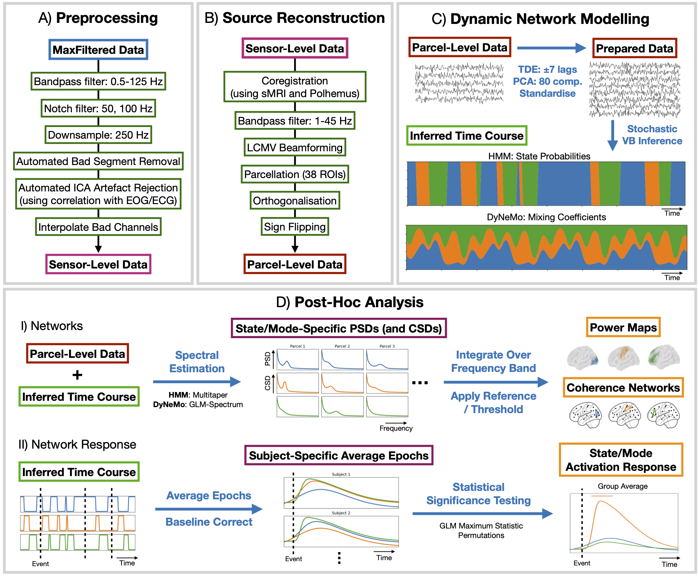

# Dynamic Network Analysis of Electrophysiological Task Data

Example scripts for reproducing the results in [Gohil et al. (2024)](https://www.biorxiv.org/content/10.1101/2024.01.12.567026v2). If you find these scripts useful, please cite:

> Gohil, C., et al. "Dynamic Network Analysis of Electrophysiological Task Data." _bioRxiv_ (2024): 2024-01.

## Pipeline Overview



## Directories

- `1_preproc_and_source_recon`: Preprocessing for the sensor-level MEG data and source reconstruction to estimate parcel time courses. 
- `2_conventional_sensor_level_analysis`: Conventional time-frequency response analysis applied to the preprocessed sensor-level data.
- `3_conventional_parcel_level_analysis`: Conventional time-frequency response analysis applied to the parcel data.
- `4_hmm_network_analysis`: HMM network inference applied to the parcel data and network response analysis.
- `5_dynemo_network_analysis`: DyNeMo network inference applied to the parcel data and network response analysis.

## Prerequisites

To run these scripts you need to install:

- [FSL](https://fsl.fmrib.ox.ac.uk/fsl/fslwiki/FslInstallation) (FMRIB Software Library) - only needed if you want to do source reconstruction.
- [Miniconda](https://docs.conda.io/projects/miniconda/en/latest/miniconda-install.html) (or [Anaconda](https://docs.anaconda.com/free/anaconda/install/index.html)).
- [OSL](https://github.com/OHBA-analysis/osl) (OHBA Software Library).
- [osl-dynamics](https://github.com/OHBA-analysis/osl-dynamics) (OSL Dynamics Toolbox) - only needed if you want to train models for dynamics.

### Linux Instructions

1. Install FSL using the instructions [here](https://fsl.fmrib.ox.ac.uk/fsl/fslwiki/FslInstallation/Linux).

2. Install [Miniconda](https://docs.conda.io/projects/miniconda/en/latest/miniconda-install.html) inside the terminal:

```
wget https://repo.anaconda.com/miniconda/Miniconda3-latest-Linux-x86_64.sh
bash Miniconda3-latest-Linux-x86_64.sh
rm Miniconda3-latest-Linux-x86_64.sh
```

3. Install OSL and osl-dynamics:

```
curl https://raw.githubusercontent.com/OHBA-analysis/Gohil2023_NetworkAnalysisOfTaskData/main/envs/linux.yml > osl.yml
conda env create -f osl.yml
rm osl.yml
```

This will create a conda environment called `osl` which contains both OSL and osl-dynamics.

### Mac Instructions

Instructions:

1. Install FSL using the instructions [here](https://fsl.fmrib.ox.ac.uk/fsl/fslwiki/FslInstallation/MacOsX).

2. Install [Miniconda](https://docs.conda.io/projects/miniconda/en/latest/miniconda-install.html) inside the terminal:

```
wget https://repo.anaconda.com/miniconda/Miniconda3-latest-MacOSX-x86_64.sh
bash Miniconda3-latest-MacOSX-x86_64.sh
rm Miniconda3-latest-MacOSX-x86_64.sh
```

3. Install OSL and osl-dynamics:

```
curl https://raw.githubusercontent.com/OHBA-analysis/Gohil2023_NetworkAnalysisOfTaskData/main/envs/mac.yml > osl.yml
conda env create -f osl.yml
rm osl.yml
```

This will create a conda environment called `osl` which contains both OSL and osl-dynamics.

### Windows Instructions

If you're using a Windows machine, you will need to install the above in [Ubuntu](https://ubuntu.com/wsl) using a Windows subsystem. 

Instructions:

1. Install FSL using the instructions [here](https://fsl.fmrib.ox.ac.uk/fsl/fslwiki/FslInstallation/Windows). Make sure you setup XLaunch for the visualisations.

2. Install [Miniconda](https://docs.conda.io/projects/miniconda/en/latest/miniconda-install.html) inside your Ubuntu terminal:

```
wget https://repo.anaconda.com/miniconda/Miniconda3-latest-Linux-x86_64.sh
bash Miniconda3-latest-Linux-x86_64.sh
rm Miniconda3-latest-Linux-x86_64.sh
```

3. Install OSL and osl-dynamics:

```
curl https://raw.githubusercontent.com/OHBA-analysis/osl/main/envs/linux.yml > osl.yml
conda env create -f osl.yml
rm osl.yml
```

This will create a conda environment called `osl` which contains both OSL and osl-dynamics.

### Test the installation

The following should not raise any errors:

```
conda activate osl
python
>> import osl
>> import osl_dynamics
```

### Get the latest source code (optional)

If you want the very latest code you can clone the GitHub repo. This is only neccessary if you want recent changes to the package that haven't been released yet.

First install OSL/osl-dynamics using the instructions above. Then clone the repo and install locally from source:

```
conda activate osl

git clone https://github.com/OHBA-analysis/osl.git
cd osl
pip install -e .
cd ..

git clone https://github.com/OHBA-analysis/osl-dynamics.git
cd osl-dynamics
pip install -e .
```

After you install from source, you can run the code with local changes. You can update the source code using

```
git pull
```

within the `osl` or `osl-dynamics` directory.

## Getting help

You can email chetan.gohil@psych.ox.ac.uk if you run into errors, need help or spot any typos. Alternatively, please open an issue on this repository.
